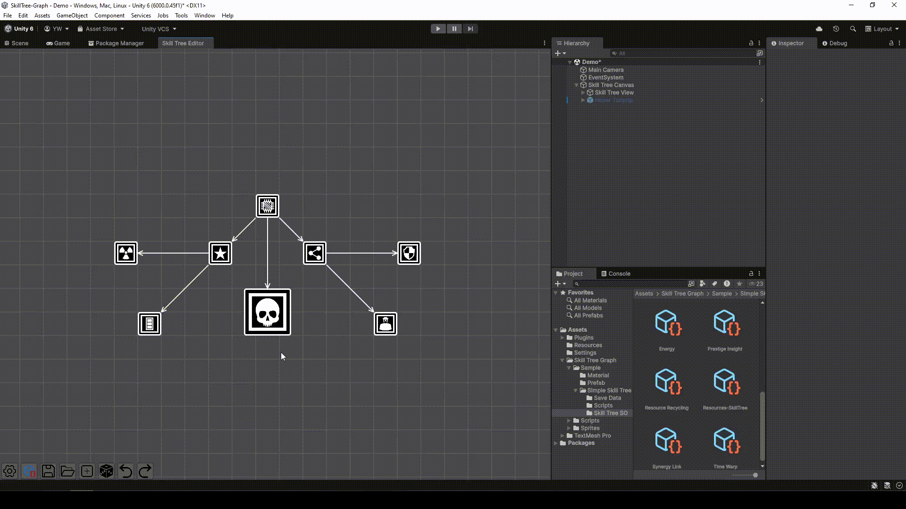
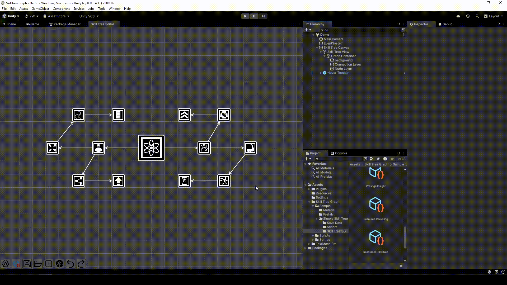
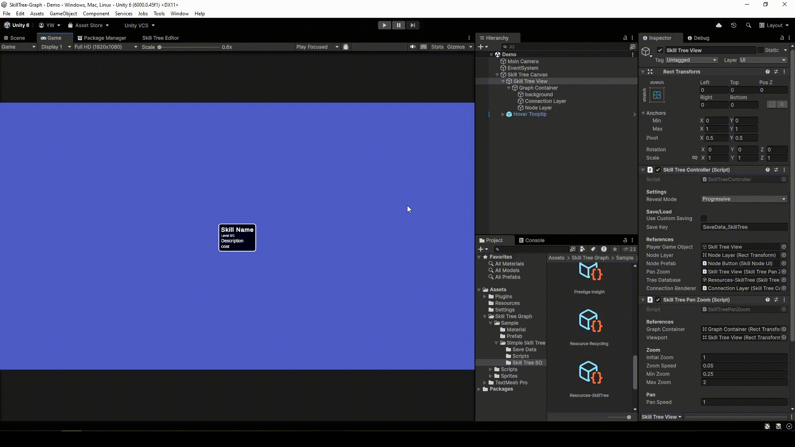

# Skill Tree Graph

A **node-based Skill Tree editor for Unity** that allows developers to visually create, connect, and manage skill trees directly inside the Unity Editor.

---

## Features

### Node-Based Skill Tree Editor
- Create skill nodes visually
- Drag nodes freely in the graph view

### Connection System
- Connect skills to define prerequisites
- Create branching skill paths

### Add, Remove & Duplicate Nodes
- Quickly create new skills node.
- Delete nodes and connections easily
- Duplicate existing node.

### Undo / Redo Support
- Undo/Redo for Created Node, Deleted Node, Connection/Disconnect Node

### Save & Load
- Save skill trees as **JSON**
- Load previously created trees for editing

### Export to ScriptableObject
- Convert graph node data into **ScriptableObjects**

### Runtime Sample
- Ready-to-use runtime example included
- Use it directly or build your own runtime with the provided core classes

---

## Preview

 \
 \


---

## Setup

### Requirements
- Unity 6.0 or Later

### Installation
- Download the `.unitypackage` from [GitHub Releases](https://github.com/kanbarudesu/SkillTree-Graph/releases/)
- Open your Unity project
- Double-click the file (or import it via **Assets > Import Package > Custom Package...**)
- Click **Import**


---

## 🎮 Keyboard Shortcuts (Skill Tree Editor)

| Action             | Shortcut                  | 
|--------------------|---------------------------|
| Create Node        | `Ctrl + Left Click`       |
| Save               | `Ctrl + S`                |
| Save As            | `Ctrl + Shift + S`        |
| Generate new Tree  | `Ctrl + N`                |
| Pan View           | `Middle Mouse Drag`       |
| Undo               | `Ctrl + Z`                |
| Redo               | `Ctrl + Y`                |
| Group Selection    | `Shift + Click Node` or `Hold Left Click + Drag`|
| Duplicate Group Selection | `Ctrl + D`|
| Delete Group Selection | `Delete`|
| Quick Node Connection | `Hold C + Click Node`|

---
## 🛠 Extensibility Guide

This system is designed to be easily extended without modifying the core system code. You can create custom logic for effects, costs, conditions, animations, and data persistence.

##

### 1. Extending the `SkillContext`
The `SkillContext` is the bridge between the Skill Tree and your game world (e.g., Player Stats, Inventory). To add your game systems:

* Open `SkillContext.cs`.
* Add your system types to the constructor or create a registration method.

```csharp
public class SkillContext : ISkillContext
{
    public GameObject PlayerRoot { get; private set; }
    private readonly Dictionary<Type, object> _systems = new();

    public SkillContext(GameObject player)
    {
        PlayerRoot = player;
        
        // Register your game systems here so Effects/Costs can find them
        _systems[typeof(PlayerStats)] = player.GetComponent<PlayerStats>();
        _systems[typeof(InventorySystem)] = player.GetComponent<InventorySystem>();
    }

    public T GetSystem<T>() where T : class
    {
        if (_systems.TryGetValue(typeof(T), out var system))
            return system as T;
        return null;
    }
}
```

## 2. Creating Custom Skill Effects
Effects are executed when a skill levels up.
* Inherit from: SkillEffect
* Logic: Override Apply(ISkillContext context, int level).

```csharp
[System.Serializable]
public class <YourEffect> : SkillEffect
{
    public float SomeValue = 0.1f;

    public override void Apply(ISkillContext context, int level)
    {
        var yourSystem = context.GetSystem<YourSystem>();
        yourSystem.DoSomething();
    }

    public override string GetDescription(int currentLevel, bool isMaxLevel)
    {
        return $"Insert Your Effect Description";
    }
}
```

## 3. Creating Custom Unlock Conditions
Conditions determine if a node becomes "Available" for purchase.
* Inherit from: SkillUnlockCondition
* Logic: Override CanUnlock(...).
```csharp
[System.Serializable]
public class <YourUnlockCondition> : SkillUnlockCondition
{
    public string conditionId;

    public override bool CanUnlock(SkillNode node, SkillTreeRuntime runtime, ISkillContext context)
    {
        //Implement your condition here
        return true;
    }

    public override string GetDescription(SkillNode node, SkillTreeRuntime runtime, ISkillContext context)
    {
        return $"Insert your condition description";
    }
}
```

## 4. Creating Custom Skill Costs
Costs define the price and check if the player can afford the upgrade.
* Inherit from: SkillCost
* Logic: Override CanAfford and Pay.
```csharp
[System.Serializable]
public class <YourSkillCost> : SkillCost
{
    public int Amount = 5;

    public override bool CanAfford(ISkillContext context, int targetLevel)
    {
        return context.GetSystem<InventorySystem>().Resource >= Amount;
    }

    public override void Pay(ISkillContext context, int targetLevel)
    {
        context.GetSystem<InventorySystem>().Resource -= Amount;
    }

    public override string GetDescription(ISkillContext context, int targetLevel)
    {
        return $"Resource : {Amount}";
    }
}
```

## 5. Creating Custom Tween Animations
The UI uses a modular tweening system. You can create custom DOTween animations for hover, click, or spawn effects.
* Inherit from: UITweenAnimation
* Logic: Override Play(RectTransform target).
```csharp
[System.Serializable]
public class <YourTweenAnimation> : UITweenAnimation
{
    public float Strength = 10f;
    public int Vibrato = 10;
    public override Tween Play(RectTransform target)
    {
        // Generate your Tween Implementation
        Tween = target.DOSomething(....)
        return Tween;
    }
}

public class YourUI : MonoBehaviour 
{
    [SerializeReference, SRPeeker] 
    public UITweenAnimation <YourTweenAnimation>;

    private void Start()
    {
        <YourTweenAnimation>.Play(transfrom as RectTransform);
    }
}

```

## 6. Implementing Custom Save Storage
By default, the system uses PlayerPrefs. To use JSON, Steam Cloud, or a Database:
* Implement ISkillTreeSaveStorage.
* Inject it into the SkillTreeController.

Json Example :
```csharp
public class JsonFileSaveStorage : ISkillTreeSaveStorage
{
    private string Path => Application.persistentDataPath + "/skilltree.json";

    public void Save(SkillTreeSaveData saveData)
    {
        string json = JsonUtility.ToJson(saveData, true);
        System.IO.File.WriteAllText(Path, json);
    }

    public SkillTreeSaveData Load()
    {
        if (!System.IO.File.Exists(Path)) return null;
        return JsonUtility.FromJson<SkillTreeSaveData>(System.IO.File.ReadAllText(Path));
    }
}
```

## 7. Adding Custom Fields to `SkillNode` (Partial Class Extension)

The core `SkillNode`, `SkillNodeSaveData`, and `SkillNodeDataMapper` classes are declared `partial` specifically so you can add your own fields without editing the package's own files. This means your additions survive package updates instead of being overwritten.

### Setup
import the separate **SkillTreeGraph-Extension** package. It adds a `Skill Tree Graph Extension` folder containing:

* `SkillNode.Extended.cs` — runtime partial class for new `SkillNode` fields
* `SkillTreeGraph.Extended.asmref` — links the file into the package's runtime assembly
* `Editor/SkillNodeSaveData.Extended.cs` — partial class for the matching save-data field
* `Editor/SkillNodeDataMapper.Extended.cs` — partial class implementing the save/load mapping
* `Editor/SkillTreeGraph.Editor.Extended.asmref` — links the editor files into the package's editor assembly

these files are safe to be **edited directly**. They're your extension point, not shipped logic. Don't delete or move the `.asmref` files; they're what makes your partial classes merge into the same assembly as the core package. Partial classes only merge within the same assembly, so without them your fields would just be a separate, unrelated type.

### Adding a field
As an example, say you want a `CritChanceBonus` field on every node.

**1. Add the field in `SkillNode.Extended.cs`:**
```csharp
namespace SkillTreeGraph.Core
{
    public partial class SkillNode
    {
        public float CritChanceBonus;
    }
}
```

**2. Add a matching field in `Editor/SkillNodeSaveData.Extended.cs`** (needed so it's included when the tree is saved to JSON):
```csharp
namespace SkillTreeGraph.Editor
{
    public partial class SkillNodeSaveData
    {
        public float CritChanceBonus;
    }
}
```

**3. Map it in `Editor/SkillNodeDataMapper.Extended.cs`:**
```csharp
namespace SkillTreeGraph.Editor
{
    public static partial class SkillNodeDataMapper
    {
        static partial void OnMapToSaveData(SkillNode node, SkillNodeSaveData data)
        {
            data.CritChanceBonus = node.CritChanceBonus;
        }

        static partial void OnMapToNode(SkillNodeSaveData data, SkillNode node)
        {
            node.CritChanceBonus = data.CritChanceBonus;
        }
    }
}
```

The new field now saves, loads, and carries over when generating ScriptableObject assets, with no changes to the core package files.

---

## Inspector Usage
Some custom classes above use [SerializeReference]. This means once you create a script inheriting from these base classes, they will automatically appear in the Add dropdown menus inside your SkillNode or SkillNodeUI inspector in Unity.

---
## Attribution

Skill Icons used in this project are created by *Craftpix.net* and obtained from [Here](https://free-game-assets.itch.io/free-cyberpunk-game-icons-for-ui).